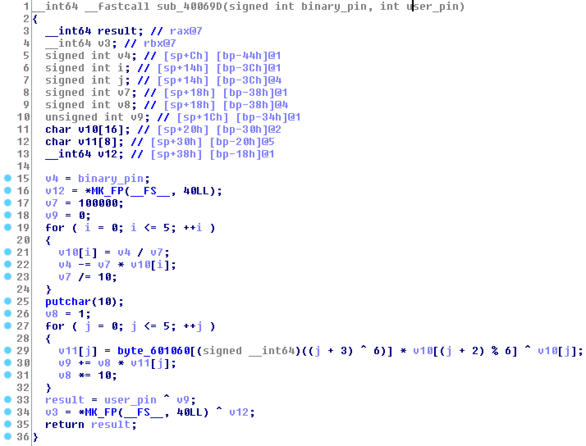
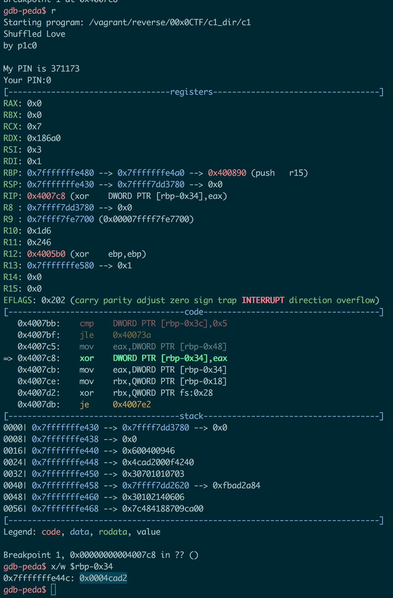

# c1 - 0x00CTF 2017

First at all execute `file` command on the binary

```bash
$ file c1
c1: ELF 64-bit LSB executable, x86-64, version 1 (SYSV), dynamically linked, interpreter /lib64/ld-linux-x86-64.so.2, for GNU/Linux 2.6.24, BuildID[sha1]=e38feffad25c4dbbd869b52a2587dd5605b1c61d, stripped
```

We have to find the correct pin to get the key

```
$ ./c1
Shuffled Love
by p1c0

My PIN is 371173
Your PIN:1337

Oh. You are not the one :(.
```

The funny (and stupid) aspect of this challenge is that the binary manipulates the PIN of the binary, not the one provided by the user (as you can see in the following decompiled function) 



So we can just put a brekpoint at the xor instruction (at `0x4007C8`) and find the value of the binary PIN after all the manipulations 



And i got the flag!

```bash
$ ./c1
Shuffled Love
by p1c0

My PIN is 371173
Your PIN:314066

You read my mind!!!. We are twin souls
--> 0x00CTF{Y0uR_th3_0n3_4cad2} <--
```

Find the binary [here](c1)! 