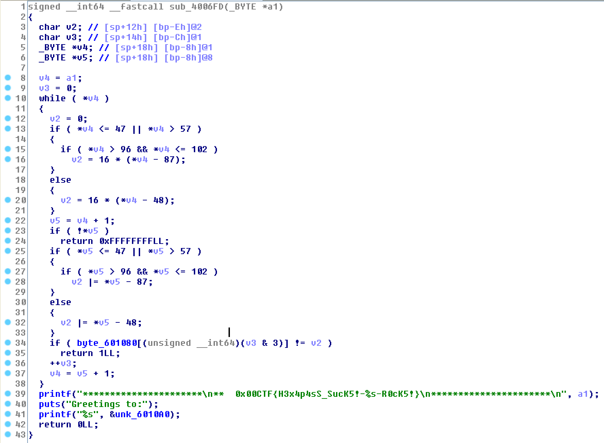

# c1 - 0x00CTF 2017

First of all execute `file` command on the binary

```bash
$ file c4
c4: ELF 64-bit LSB executable, x86-64, version 1 (SYSV), dynamically linked, interpreter /lib64/ld-linux-x86-64.so.2, for GNU/Linux 2.6.24, BuildID[sha1]=bb4cb471badbe69e05e1a4f2448edf72d9ef9c28, stripped
```

We have to find the correct pin to get the key

```
$ ./c4
Program protected by HexaPass(TM)

Enter key: 1234
Wrong Key!

--
Crackme by pico
  Greetings to the 0x00sec.org Community
```

Look at the `while` loop



we just need to execute the `printf` functions, i.e. process the entire user input successfully. It's quite weird, because if we just send `\n` as input we can printf a flag of course

```bash
$ ./c4
Program protected by HexaPass(TM)

Enter key:
**********************
**  0x00CTF{H3x4p4sS_SucK5!--R0cK5!}
**********************
Greetings to:
...
```

Not only `\n` prints a flag as you can figure out by the code. But.. anyway, i wrote this shitty script

```python
code = [0xba ,0xbe , 0xca, 0xb1]
s = ""
for i in range(4):
	for x in range(255):
		for y in range(255):
			if x <= 47 or x > 57:
				if x > 96 and x <= 102:
					v2 = 16 * (x - 87)
			else:
				v2 = 16 * (x - 48)
			if y <= 47 or y > 57:
				if y > 96 and y <= 102:
					v2 |= y - 87
			else:
				v2 |= y - 48
			if code[i % 4] == v2:
				s += chr(x) + chr(y)

print s
```

I tried to submit some flags and at the end the key with length 8 was correct, and finally i got the flag!

```bash
$ ./c4
Program protected by HexaPass(TM)

Enter key: babecab1
**********************
**  0x00CTF{H3x4p4sS_SucK5!-babecab1-R0cK5!}
**********************
Greetings to:

  .:xKOo'              ,dKKd;.   'd0Kx:.   :ddddddddd: 'dddddddd:   :dddddddd;
 kMMMMMMMN.          'NMMMMMMWo.NMMMMMMWd  OMMMMMMMMMO lMMMMMMMM0 :NMMMMMMMMMk
 0MW00MMMM'          ,MMXkXMMMk.MMNkOMMMk  OMMMx''KMMO lMMMK''''. OMMMx''xMMMk
 d:. lMMMW...      . 'x'  OMMMx.O'  lMMMk  OMMMK:..''. lMMM0....  OMMMl  :XXXd
 ONO:dMMMM'kWOc.'lOW',WOl'OMMMk'W0o,dMMMk  .dKMMMWO;   lMMMMMMMMl OMMMl
 0MMMo'lON'kMMMMMMX: ,MMMM;:xNk'MMMMd;dXk     'dNMMMNc lMMMNdddd' OMMMl
 0MMMl .:O..lNMMMMMW.,MMMM' ,xd.WMMMl 'dd  ,:::. dMMMO lMMMO      OMMMl  .:::'
 0MMMKKMMM':KW0dxKMM',MMMM0NMMk'MMMMXNMMk  OMMMO:xMMMO lMMMX::::: OMMMO::OMMMk
 dWMMMMMM0.;:.    .c..XMMMMMMX:.0MMMMMMNo  OMMMMMMMMMO lMMMMMMMMM.OMMMMMMMMWx.
   'dOx:.              'lkOo'    .ckOd'    ,:::::::::, .::::::::: ,::::::::.

--
Crackme by pico
  Greetings to the 0x00sec.org Community
```


Find the binary [here](c4)!
