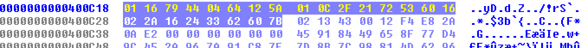

# hello - 0x00CTF 2017

First of all execute `file` command on the binary

```bash
$ file hello
hello: ERROR: ELF 64-bit LSB executable, x86-64, version 1 (SYSV), dynamically linked, interpreter /lib64/ld-linux-x86-64.so.2, for GNU/Linux 2.6.24, BuildID[sha1]=b8ccefeffb8978b2289ec31802396333def9dfad error reading (Invalid argument)
```

We have to guess the key as usual

```
$ ./hello
Welcome to the Twinlight Zone!!!
Password: hello
Keep Trying!
```

The ELF is corrupted and it's not trivial to perform a dymanic analysis of the crackme. So let's do it statically! The static analysis was quite easy, the binary just xor each char of the user input with a byte in the .bss and checks if it's equal to a certain value.
In this image i show just the first part of the function that checks the key (the rest of the key trivial)


And the values at `cs:off_602088` are



To get the key i just did this:

```python
base = [0x30, 0x78, 0x30, 0x30, 0x43, 0x54, 0x46, 0x7b]
code = ['0x01', '0x16', '0x79', '0x44', '0x04', '0x64', '0x12', '0x5A']
code = map(lambda x : int(x,16), code)
print "".join(map(lambda (x,y) : chr(x ^ y), zip(base, code)))
```

And i got the flag!

```bash
$ ./hello
Welcome to the Twinlight Zone!!!
Password: 1nItG0T!
0x00CTF{0bfU5c473D_PtR4Z3}
```

Find the binary [here](hello)!
