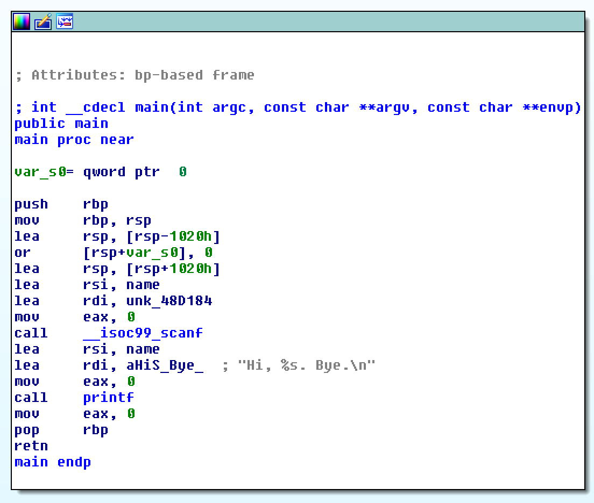
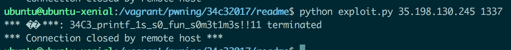

# readme_revenge - 34C3 2017 CTF

This pwnable was ABSOLUTELY amazing! I had a fantastic time solving this (30 solves during the competition).
First of all execute `file` command on the binary
```bash
$ file readme_revenge
readme_revenge: ELF 64-bit LSB executable, x86-64, version 1 (GNU/Linux), statically linked, for GNU/Linux 2.6.32, BuildID[sha1]=2f27d1b57237d1ab23f8d0fc3cd418994c5b443d, not stripped
```

And [checksec](https://github.com/slimm609/checksec.sh)
```bash
$ ./checksec --file ../pwning/34c32017/readme/readme_revenge
RELRO           STACK CANARY      NX            PIE             RPATH      RUNPATH	FORTIFY	Fortified Fortifiable  FILE
Partial RELRO   Canary found      NX enabled    No PIE          No RPATH   No RUNPATH   Yes	3		45	../pwning/34c32017/readme/readme_revenge
```

I had a very quick overview on the binary. I always run `strings` command trying to grep `flag`, `flag{` or other stuff like that (old habits :) ).
And... WAT?

```bash
$ strings readme_revenge | grep 34C3
34C3_XXXXXXXXXXXXXXXXXXXXXXXXXXXXXX
```

It's clear that the server already have the flag stored in memory, we "just" have to figure out how to print it! This clarify a lot our POC of the exploit.

Back to us.. this is the main



Where `name` is at address `0x6B73E0` in the `.bss` section. What we can do is to overflow the buffer and overwrite some libc's pointer.
Let's have a look at the `bss` and at the pointers that we can overwrite (i report here only the pointers that we need for the exploit!):

```bash
0x6B73E0 name
0x6B7400 _dl_tls_static_used (useless)
0x6B7408 _dl_tls_static_align (useless)
0x6B7410 _dl_tls_max_dtv_idx (useless)
0x6B7420 _dl_static_dtv (useless)
0x6B7430 unk_6B7430 (useless)
0x6B78A8 _dl_profile_output (useless)
0x6B78B0 _dl_platformle (useless)
....         shit (useless)
....         shit (useless)
0x6B7970 __libc_enable_secure_decided (useless)
0x6B7978 __libc_argc (useless)
0x6B7980 __libc_argv               <------- cool!
....         shit
....         shit
0x6B7A28 __printf_function_table   <------- cool!
0x6B7A30 __printf_modifier_table  (useless)
0x6B7A38 __tzname_cur_max  (useless)
0x6B7A40 __use_tzfile  (useless)
....         shit
....         shit
0x6B7AA8 __printf_arginfo_table    <------- cool!
0x6B7AB0 __printf_va_arg_table (useless)
```

No way: we have to figure out how to use those pointers and print the flag at address `0x6B4040`. I went through the printf implementation in the libc trying to figure out how to
use some of those pointers to get control of the program. After some hours i found this (for details of the procedure please see references and comments inside the code of libc):

1) `printf` calls `vfprintf` (see the implementation of the `vfprintf` )
2) look at this snippet:
```C
	  /* Use the slow path in case any printf handler is registered.  */
	  if (__glibc_unlikely (__printf_function_table != NULL
	                        || __printf_modifier_table != NULL
	                        || __printf_va_arg_table != NULL))
	    goto do_positional;
```

Remember that we control these pointers, so we can go to `do_positional` label if we want ;)
3) `do_positional` calls `printf_positional`
4) `printf_positional` calls `__parse_one_specwc` function, and now things become interesting (see `__parse_one_specwc` implementation [here](https://code.woboq.org/userspace/glibc/stdio-common/printf-parsemb.c.html))
5)  look at this portion of code inside `__parse_one_specwc`:
```C
	  if (__builtin_expect (__printf_function_table == NULL, 1)
	      || spec->info.spec > UCHAR_MAX
	      || __printf_arginfo_table[spec->info.spec] == NULL
	      /* We don't try to get the types for all arguments if the format
	         uses more than one.  The normal case is covered though.  If
	         the call returns -1 we continue with the normal specifiers.  */
	      || (int) (spec->ndata_args = (*__printf_arginfo_table[spec->info.spec])
	                                   (&spec->info, 1, &spec->data_arg_type,
	                                    &spec->size)) < 0)
	    {
```
COOOL! What we can do here is to modify all the pointers in a way that all the conditions are `False` and the function pointer `(*__printf_arginfo_table[spec->info.spec]` is called.
Remember that in C conditions are lazy evaluated. So for instance if `__builtin_expect (__printf_function_table == NULL, 1)` is True `__printf_arginfo_table[spec->info.spec] == NULL` is not evaluated, because the OR espression is already True and the second condition would not change the final result).

`__printf_arginfo_table` is a structure of type `printf_arginfo_size_function`: i can create a fake structure inside the portion of the `bss` that i control in a way that i can jump to an arbitrary address when `*__printf_arginfo_table[spec->info.spec]` is called. `spec` is a structure, and `info.spec` is the character used in the format string of the `printf` call. In our case the `printf` function was called with `%s`, so `spec->info.spec` is equal to `ord('s')`.

In order to print the flag i call the `_fortify_fail` function and i overwrite the `_libc_argv` double pointer so that it points to an address containing the address of `flag`.

The exploit in a nutshell:
1) Do buffer overflow to
2) Create a fake `printf_arginfo_size_function` structure, that contains the address of a `call _fortify_fail`
3) overwrite the `** _libc_argv` so that the `_fortify_fail` will print the flag instead of the "real" `_libc_argv` arguments
4) overwrite `__printf_function_table` so that it is not NULL
5) overwrite `__printf_arginfo_table` so that it points to the fake structure

And WIN!



Find the binary [here](readme_revenge), the full exploit [here](exploit.py)! THIS CHALLENGE WAS ABSOLUTELY AMAZING, thanks to 34C3 organizers for the great fun!!
