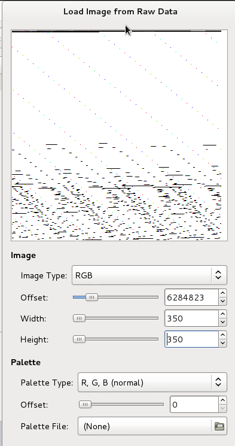
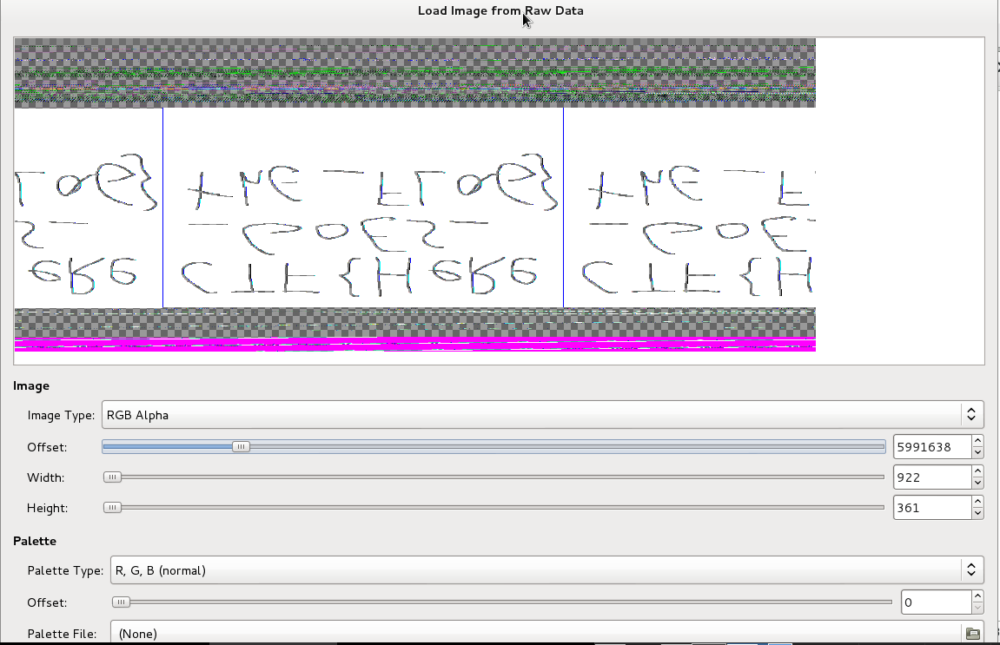
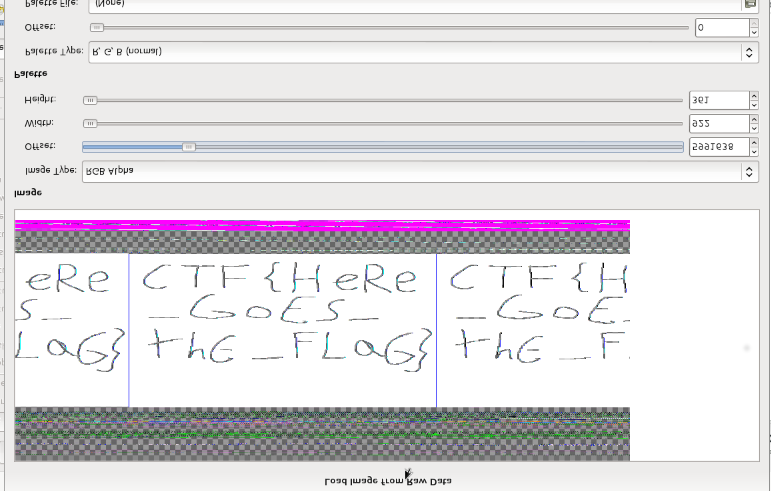

# for1 - GoogleCTF

First of all i executed `file` after unzipping the archive 
```bash
file dump1.raw 
dump1.raw: ELF 64-bit LSB core file x86-64, version 1 (SYSV) 
```
With 
```bash
$ hexdump -C dump1.raw | less
00000000  7f 45 4c 46 02 01 00 00  00 00 00 00 00 00 00 00  |.ELF............|
00000010  04 00 3e 00 01 00 00 00  00 00 00 00 00 00 00 00  |..>.............|
00000020  40 00 00 00 00 00 00 00  00 00 00 00 00 00 00 00  |@...............|
00000030  00 00 00 00 40 00 38 00  09 00 40 00 00 00 00 00  |....@.8...@.....|
00000040  04 00 00 00 04 00 00 00  38 02 00 00 00 00 00 00  |........8.......|
00000050  00 00 00 00 00 00 00 00  00 00 00 00 00 00 00 00  |................|
00000060  70 22 00 00 00 00 00 00  70 22 00 00 00 00 00 00  |p"......p"......|
00000070  00 00 00 00 00 00 00 00  01 00 00 00 04 00 00 00  |................|
00000080  a8 24 00 00 00 00 00 00  00 00 00 00 00 00 00 00  |.$..............|
00000090  00 00 00 00 00 00 00 00  00 00 00 30 00 00 00 00  |...........0....|
000000a0  00 00 00 30 00 00 00 00  00 00 00 00 00 00 00 00  |...0............|
000000b0  01 00 00 00 04 00 00 00  a8 24 00 30 00 00 00 00  |.........$.0....|
000000c0  00 00 00 00 00 00 00 00  00 00 00 e0 00 00 00 00  |................|
000000d0  00 00 00 08 00 00 00 00  00 00 00 08 00 00 00 00  |................|
000000e0  00 00 00 00 00 00 00 00  01 00 00 00 04 00 00 00  |................|
000000f0  a8 24 00 38 00 00 00 00  00 00 00 00 00 00 00 00  |.$.8............|
00000100  00 00 00 f0 00 00 00 00  00 00 00 00 00 00 00 00  |................|
00000110  00 00 02 00 00 00 00 00  00 00 00 00 00 00 00 00  |................|
00000120  01 00 00 00 04 00 00 00  a8 24 00 38 00 00 00 00  |.........$.8....|
00000130  00 00 00 00 00 00 00 00  00 00 40 f0 00 00 00 00  |..........@.....|
00000140  00 00 40 00 00 00 00 00  00 00 40 00 00 00 00 00  |..@.......@.....|
00000150  00 00 00 00 00 00 00 00  01 00 00 00 04 00 00 00  |................|
00000160  a8 24 40 38 00 00 00 00  00 00 00 00 00 00 00 00  |.$@8............|
00000170  00 00 80 f0 00 00 00 00  00 40 00 00 00 00 00 00  |.........@......|
00000180  00 40 00 00 00 00 00 00  00 00 00 00 00 00 00 00  |.@..............|
00000190  01 00 00 00 04 00 00 00  a8 64 40 38 00 00 00 00  |.........d@8....|
000001a0  00 00 00 00 00 00 00 00  00 00 c0 fe 00 00 00 00  |................|
000001b0  00 00 00 00 00 00 00 00  00 10 00 00 00 00 00 00  |................|
000001c0  00 00 00 00 00 00 00 00  01 00 00 00 04 00 00 00  |................|
000001d0  a8 64 40 38 00 00 00 00  00 00 00 00 00 00 00 00  |.d@8............|
000001e0  00 00 e0 fe 00 00 00 00  00 00 00 00 00 00 00 00  |................|
000001f0  00 10 00 00 00 00 00 00  00 00 00 00 00 00 00 00  |................|
00000200  01 00 00 00 04 00 00 00  a8 64 40 38 00 00 00 00  |.........d@8....|
00000210  00 00 00 00 00 00 00 00  00 00 ff ff 00 00 00 00  |................|
00000220  00 00 01 00 00 00 00 00  00 00 01 00 00 00 00 00  |................|
00000230  00 00 00 00 00 00 00 00  06 00 00 00 18 00 00 00  |................|
00000240  00 0b 00 00 56 42 43 4f  52 45 00 00 de c0 1a c0  |....VBCORE......|
00000250  03 00 01 00 18 00 00 00  10 00 00 05 8f 9d 01 00  |................|
00000260  01 00 00 00 05 00 00 00  30 22 00 00 01 0b 00 00  |........0"......|
00000270  56 42 43 50 55 00 00 00  00 55 3c 63 00 f8 ff ff  |VBCPU....U<\c....|
```
I see that this is a dump of a VirtualBox instance,  by looking at `VBCORE` and `VBCPU` strings.

I usually solve this kind of challenge with `volatility`, but honestly i had some problem that tool during the CTF. So i thought "why don't try `Rekall` this time"? 
So i loaded the dump image into Rekall workspace
```bash
$ Rekal -f dump1.raw
```
and printed the list of process
```bash
>>> pslist()
  _EPROCESS            Name          PID   PPID   Thds    Hnds    Sess  Wow64           Start                     Exit          
-------------- -------------------- ----- ------ ------ -------- ------ ------ ------------------------ ------------------------
0xe00032553780 System                   4      0    126        -      - False  2016-04-04 16:12:33Z     -                       
0xe00033f1f780 sihost.exe              92    796     10        -      1 False  2016-04-04 16:12:37Z     -                       
0xe0003389c040 smss.exe               268      4      2        -      - False  2016-04-04 16:12:33Z     -                       
0xe000349285c0 taskhostw.exe          332    796     10        -      1 False  2016-04-04 16:17:40Z     -                       
0xe0003381b080 csrss.exe              344    336      8        -      0 False  2016-04-04 16:12:33Z     -                       
0xe000325ba080 wininit.exe            404    336      1        -      0 False  2016-04-04 16:12:34Z     -                       
0xe000325c7080 csrss.exe              412    396      9        -      1 False  2016-04-04 16:12:34Z     -                       
0xe00033ec6080 winlogon.exe           460    396      2        -      1 False  2016-04-04 16:12:34Z     -                       
0xe00033efb440 services.exe           484    404      3        -      0 False  2016-04-04 16:12:34Z     -                       
0xe00033f08080 lsass.exe              492    404      6        -      0 False  2016-04-04 16:12:34Z     -                       
0xe00033ec5780 svchost.exe            580    484     16        -      0 False  2016-04-04 16:12:34Z     -                       
0xe00034377780 svchost.exe            608    484     17        -      0 False  2016-04-04 16:12:34Z     -                       
0xe00034202280 svchost.exe            612    484      9        -      0 False  2016-04-04 16:12:34Z     -                       
0xe00034ade080 svchost.exe            628    484      1        -      1 False  2016-04-04 16:14:43Z     -                       
0xe000341cb640 dwm.exe                712    460      8        -      1 False  2016-04-04 16:12:34Z     -                       
0xe00034222780 svchost.exe            796    484     45        -      0 False  2016-04-04 16:12:34Z     -                       
0xe000342a7780 VBoxService.ex         828    484     10        -      0 False  2016-04-04 16:12:34Z     -                       
0xe000342ad780 svchost.exe            844    484      8        -      0 False  2016-04-04 16:12:34Z     -                       
0xe000342c0080 svchost.exe            852    484      6        -      0 False  2016-04-04 16:12:34Z     -                       
0xe000342dd780 svchost.exe            892    484     18        -      0 False  2016-04-04 16:12:34Z     -                       
0xe000342bc780 svchost.exe            980    484     17        -      0 False  2016-04-04 16:12:34Z     -                       
0xe000343e7780 spoolsv.exe           1072    484      8        -      0 False  2016-04-04 16:12:34Z     -                       
0xe000343e9780 svchost.exe           1092    484     23        -      0 False  2016-04-04 16:12:35Z     -                       
0xe0003442a780 rundll32.exe          1148    796      1        -      0 False  2016-04-04 16:12:35Z     -                       
0xe00034494780 CompatTelRunne        1224   1148      9        -      0 False  2016-04-04 16:12:35Z     -                       
0xe00034495780 svchost.exe           1276    484     10        -      0 False  2016-04-04 16:12:35Z     -                       
0xe0003259b3c0 taskhostw.exe         1532    796      9        -      1 False  2016-04-04 16:12:37Z     -                       
0xe0003461d780 svchost.exe           1564    484      5        -      0 False  2016-04-04 16:12:35Z     -                       
0xe000345da780 wlms.exe              1616    484      2        -      0 False  2016-04-04 16:12:35Z     -                       
0xe00034623780 MsMpEng.exe           1628    484     24        -      0 False  2016-04-04 16:12:35Z     -                       
0xe00034b08780 OneDrive.exe          1692   2336     10        -      1 True   2016-04-04 16:12:55Z     -                       
0xe00033e00780 svchost.exe           1772    484      3        -      0 False  2016-04-04 16:12:37Z     -                       
0xe000343b2340 cygrunsrv.exe         1832    484      4        -      0 False  2016-04-04 16:12:35Z     -                       
0xe0003479b780 cygrunsrv.exe         1976   1832      0        -      0 False  2016-04-04 16:12:36Z     2016-04-04 16:12:36Z    
0xe000347aa780 conhost.exe           2004   1976      2        -      0 False  2016-04-04 16:12:36Z     -                       
0xe0003472b080 notepad.exe           2012   2336      1        -      1 False  2016-04-04 16:14:49Z     -                       
0xe000347c1080 sshd.exe              2028   1976      3        -      0 False  2016-04-04 16:12:36Z     -                       
0xe000339d4340 NisSrv.exe            2272    484      6        -      0 False  2016-04-04 16:12:38Z     -                       
0xe000336e8780 userinit.exe          2312    460      0        -      1 False  2016-04-04 16:12:38Z     2016-04-04 16:13:04Z    
0xe000336e3780 explorer.exe          2336   2312     31        -      1 False  2016-04-04 16:12:38Z     -                       
0xe0003374f780 RuntimeBroker.        2456    580      6        -      1 False  2016-04-04 16:12:38Z     -                       
0xe00033a39080 SearchIndexer.        2664    484     13        -      0 False  2016-04-04 16:12:39Z     -                       
0xe00033a79780 ShellExperienc        2952    580     41        -      1 False  2016-04-04 16:12:39Z     -                       
0xe000349e4780 WmiPrvSE.exe          3032    580      6        -      0 False  2016-04-04 16:16:37Z     -                       
0xe00033b57780 SearchUI.exe          3144    580     38        -      1 False  2016-04-04 16:12:40Z     -                       
0xe000348c6780 VBoxTray.exe          3324   2336     10        -      1 False  2016-04-04 16:12:55Z     -                       
0xe00033e1d780 DismHost.exe          3636   1224      2        -      0 False  2016-04-04 16:12:47Z     -                       
0xe000348e9780 svchost.exe           3992    484      6        -      0 False  2016-04-04 16:12:52Z     -                       
0xe00034b0f780 mspaint.exe           4092   2336      3        -      1 False  2016-04-04 16:13:21Z     -                       
Plugin: pslist
```
this was my first WIN10 image, but the default process of windows seemed not malicius to me (however i spent some time by checking them because i didn't solve this chall immediatly) . So with the `pstree` plugin i focused on user processes
```bash
>>> pstree()
_EPROCESS                                 PPid   Thds   Hnds            Time          
---------------------------------------- ------ ------ ------ ------------------------
...
...
...
. 0xe000341cb640 dwm.exe (712)              460      8      - 2016-04-04 16:12:34Z    
. 0xe000336e8780 userinit.exe (2312)        460      0      - 2016-04-04 16:12:38Z    
.. 0xe000336e3780 explorer.exe (2336)      2312     31      - 2016-04-04 16:12:38Z    
... 0xe00034b08780 OneDrive.exe (1692)     2336     10      - 2016-04-04 16:12:55Z    
... 0xe0003472b080 notepad.exe (2012)      2336      1      - 2016-04-04 16:14:49Z    
... 0xe000348c6780 VBoxTray.exe (3324)     2336     10      - 2016-04-04 16:12:55Z    
... 0xe00034b0f780 mspaint.exe (4092)      2336      3      - 2016-04-04 16:13:21Z    
  0xe00032553780 System (4)                   0    126      - 2016-04-04 16:12:33Z    
. 0xe0003389c040 smss.exe (268)               4      2      - 2016-04-04 16:12:33Z    
Plugin: pstree
```
I had 3 candidates: `OneDrive`, `notepad` and `paint`. Rekal has too many nice plugins, and i tried a lot of them. I checked too many informations about these 3 processes, like dumping handled files by the processes but with no luck.
After 12 hours searching for any suspicius thing, i realized that if the user uses paint without open and write files the temporary file is memorized in RAM (and this is the reason why `handles` plugin didn't show anything good!). So i dumped the memory used by paint's process
```bash
>>> memdump(pid=4092)
**************************************************
Writing 0xe00034b0f780 mspaint.exe  4092 to mspaint.exe_4092.dmp
Plugin: memdump
```
renamed the `mspaint.exe_4092.dmp` file with `mspaint.exe_4092.data` and opened this with gimp (because i'm looking for an image!).

Manually i looked for anything that seemed an image



with this offset i got something interesting. Playing a little bit with `width` and `height` i got 



and flipping that we had the solution



I had a lot of fun solving that challenge, in particular i discover Rekall and in my opinion in some cases it is so much better than volatility.
