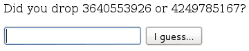
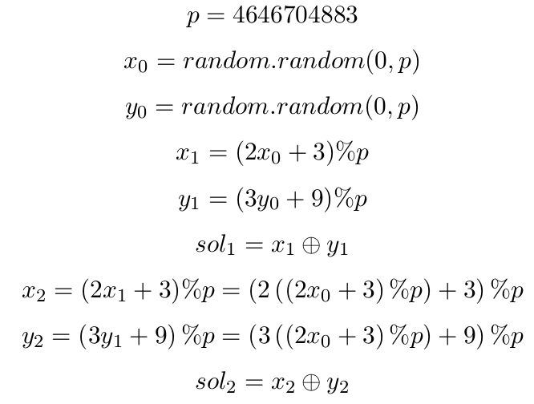
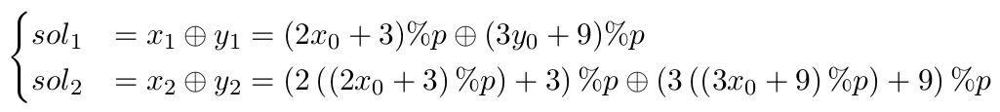
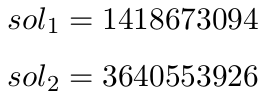

# woodman - Google CTF
*Solved by @r00ta and @dariosharp

This crypto challenge (https://giant-goannas.ctfcompetition.com/) has a quite easy request



So we have to choose the right number n-times consecutively. If we make a mistake, we have to repeat this process from the beginning (obviously with different numbers).

In the comment of the previous web page of the challenge we find this code
```python
class SecurePrng(object):
    def __init__(self):
        # generate seed with 64 bits of entropy
        self.p = 4646704883L
        self.x = random.randint(0, self.p)
        self.y = random.randint(0, self.p)

    def next(self):
        self.x = (2 * self.x + 3) % self.p
        self.y = (3 * self.y + 9) % self.p
        return (self.x ^ self.y)
```
So let's do some math



so assume that we know the first two correct number (just guess that): we only have to solve this system of equations in order 
to find the first two random integer



We guess the fist two step (not so difficult, it happens with 0.25 probability): in our case



`Mathematica` refuses to solve that equation system: no problem, let's use z3!

```python
from z3 import *
import sys

s1cor = int(sys.argv[1])
s2cor = int(sys.argv[2])
dimVector =35
x = BitVec('x', dimVector)
y = BitVec('y', dimVector)
p = BitVec('p',dimVector)
s1 = BitVec('s1',dimVector)
s2 = BitVec('s2',dimVector)
s = Solver()
s.add(p == 4646704883L)
s.add(s1 == s1cor)
s.add(s2== s2cor)
s.add( ( ( ( 2 * x + 3 ) % p ) ^ ( ( 3 * y + 9 ) % p ) )==s1)
s.add(( ( ( 2 * ( ( 2 * x + 3 ) % p )  + 3 ) % p ) ^ ( ( 3 * ( (  3 * y + 9 ) % p) + 9 ) % p ) )==s2)
while s.check() == sat:
	class SecurePrng(object):
		def __init__(self,x,y):
			self.p = 4646704883L
			self.x = x
			self.y = y
		def next(self):
			self.x = (2 * self.x + 3) % self.p
			self.y = (3 * self.y + 9) % self.p
			return (self.x ^ self.y)	
		def getX(self):
			return self.x
		def getY(self):
			return self.y
	m = s.model()
	pMy = 4646704883L
	myObj = SecurePrng(int(str(m[x]))%pMy,int(str(m[y]))%pMy)
	mySol1 = myObj.next()
	mySol2 = myObj.next()
	if mySol1 == s1cor and mySol2 == s2cor and int(str(m[x]))<= pMy and int(str(m[y])) <= pMy :
		print "x = " + str(m[x]) + " ; y = " + str(m[y]) 
	s.add(Or(x != s.model()[x], y != s.model()[y]))
```

just few notes: there are more than one solution of that system, so we check every solution that z3 proposes.

Run that shit!

```bash
$ time python solver.py 3640553926 1418673094
x = 3714993585 ; y = 2248563082

real	0m0.591s
user	0m0.556s
sys	0m0.012s
```
ok: we found the two random seed and and we were able to generate all the solution. 
```bash
>>> import random
>>> 
>>> class SecurePrng(object):
...     def __init__(self):
...             self.i = 0
...         self.p = 4646704883L
...         self.x = 3714993585 % self.p
...         self.y = 2248563082 % self.p
...     def next(self):
...             print self.i
...             self.i += 1
...         self.x = (2 * self.x + 3) % self.p
...         self.y = (3 * self.y + 9) % self.p
...         return (self.x ^ self.y)
...     def getX(self):
...             return self.x
...     def getY(self):
...             return self.y
... 
>>> 
>>> mySol = SecurePrng()
>>> print "x0 = " + str(mySol.getX())
x0 = 3714993585
>>> print "y0 = " + str(mySol.getY())
y0 = 2248563082
>>> print mySol.next()
0
3640553926
>>> print "x1 = " + str(mySol.getX())
x1 = 2783282290
>>> print "y1 = " + str(mySol.getY())
y1 = 2098984372
>>> print mySol.next()
1
1418673094
>>> print mySol.next()
2
2142807111
>>> print mySol.next()
3
3977384148
...
...
>>> print mySol.next()
100
31332507
```
After 100 step we get the flag
CTF{_!_aRe_y0U_tH3_NSA_:-?_!_}

