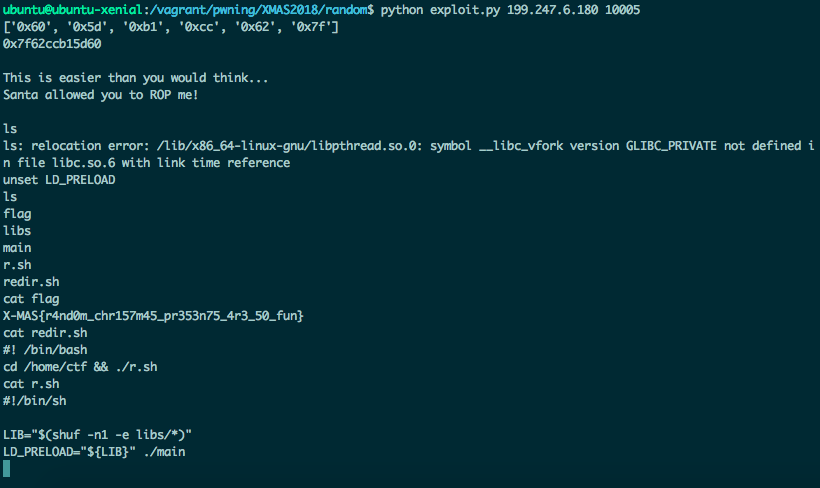

# random greetings - XMAS ctf 2018

This is the PoC of the exploit:
1) buffer overflow and leak libc address with a ropchain
2) jump to main again with a gadget
3) exploit the program again with the overflow
4) jump to a magic gadget in the libc

Actually different connections faced different libc addresses, so i guessed that the server had a
set of libc and i looked for a known libc. In one execution i got this
`libc6_2.19-0ubuntu6.14_amd64.so` version of the libc, so i adjusted the exploit to use a magic
gadget of this libc and i run the exploit 5 or 6 times (until the libc i leaked was used again). 

The full exploit is [here](exploit.py)!
